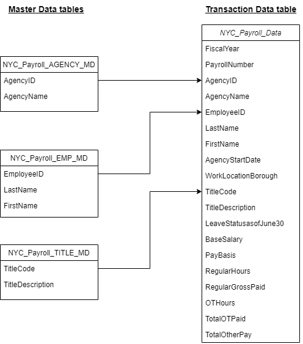

# Data Integration Pipelines for NYC Payroll Data Analytics
Udacity Data Engineering Nanodegree Azure Data Integration Pipelines for NYC Payroll Data Analytics Project Submission

Created by: __Mihaly Garamvolgyi__

# Task descripton

 ## Project Overview

The City of New York would like to develop a Data Analytics platform on Azure Synapse Analytics to accomplish two primary objectives:

Analyze how the City's financial resources are allocated and how much of the City's budget is being devoted to overtime.
Make the data available to the interested public to show how the City’s budget is being spent on salary and overtime pay for all municipal employees.
You have been hired as a Data Engineer to __create high-quality data pipelines__ that are dynamic, can be automated, and monitored for efficient operation. The project team also includes the city’s quality assurance experts who will test the pipelines to find any errors and improve overall data quality.

The source data resides in Azure Data Lake and needs to be processed in a NYC data warehouse. The __source datasets consist of CSV files__ with Employee master data and monthly payroll data entered by various City agencies.

_NYC Payroll DB Schema_

__Azure Data Factory__ is used to create Data views in __Azure SQL DB__ from the source data files in __DataLake Gen2__. Then we built our __dataflows and pipelines__ to create payroll aggregated data that will be exported to a target directory in DataLake Gen2 storage over which __Synapse Analytics external table__ is built. At a high level the pipeline will look like below

_High Level Pipeline Overview_

 ## Project Environment

For this project, the Azure Portal is used, using several Azure resources including:

* Azure Data Lake Gen2 
* Azure SQL DB
* Azure Data Factory
* Azure Synapse Analytics

Screenshots as a proof of work is collected along the way. The project work is stored in a Github repo. 

Project data is available in csv files but not uploaded to the repository.

 ## Project Instructions

### Step 1: Prepare the Data Infrastructure

1. Create an Azure Data Lake Storage Gen2 (storage account) and associated storage container resource named __adlsnycpayroll-yourfirstname-lastintial__. with the provided characteristics. Create the required directorires in the storage container. Upload datafiles to the folders as per description

2. Create an Azure Data Factory resource

3. Create an SQL Database named __db_nycpayroll__

4. Create a Synapse Analytics workspace and create a database within, and an Azure Data Lake Gen2 while creating the resource

5. Create summary data external table in Synapse Analytics workspace. Define file format. The table should reference the dirstaging directory of Data Lake.

6. Create master data tables and payroll transaction tables in SQL DB

### Step 2: Create Linked Services

1. Create a Linked Service for Azure Data Lake

2. Create a Linked Service to SQL Database that has the current (2021) data 

### Step 3: Create Datasets in Azure Data Factory

1. Create the dataset for the 2021 Payroll file in ADLS

2. Create the dataset for the remaining 3 files

3. Create the datastet for all the data tables in SQL DB

4. Create the datasets for the destination (target) table in Synapse Analytics (NYC_Payroll_Summary)

### Step 4: Create Dataflows

In Azure Data Factory, create data flows to load data from Azure DataLake Gen2 storage to SQL db table created earlier

1. 2020 Payroll data
2. All other files

### Step 5: Data Aggregation and Parameterization

Extract the 2021 year data and historical data, merge, aggregate and store it in DataLake staging area

1. Create new data flow 
2. Add source 1
3. Add source 2
4. Create a new Union activity 
5. Add a Filter activity
6. Create a parameter 
7. Create a Derived Column
8. Add an Aggregate activity
9. Add a Sink activity 
10. Add another Sink activity

### Step 6: Pipeline Creation

Create a pipeline to load data from Azure DataLake Gen2 storage in SQL db

### Step 7: Trigger and Monitor Pipeline

1. Select Add trigger option from pipeline view in the toolbar
2. Choose trigger now to initiate pipeline run
3. You can go to monitor tab and check the Pipeline Runs
4. Each dataflow will have an entry in Activity runs list

### Step 8: Verify Pipeline run artifacts

1. Query data in SQL DB summary table (destination table). 
2. Check the dirstaging directory in Datalake if files got created. 
3. Query data in Synapse external table that points to the dirstaging directory in Datalake.

### Step 9: Connect your Project to Github

1. Login to your Github account and create a new Repo in Github
2. Connect Azure Data Factory to Github
3. Select your Github repository in Azure Data Factory
4. Publish all objects to the repository in Azure Data Factory

 ## Project Rubric

 # Project Solution

### Step 1: Prepare the Data Infrastructure
Captured screenshots of Step 1 are displayed here:

#### DataLakeGen2 that shows files are uploaded

#### Above 5 tables created in SQL db

#### External table created in Synapse

### Step 2: Create Linked Service
Captured screenshots amd configs of Step 2 are displayed here:

#### Linked Services Page

#### Configs of Linked Service

[Linked Service Configuration](configs/xxx.json)

### Step 3: Create Datasets in Azure Data Factory

#### Screenshots of datasets in Data Factory 

#### Configs of Datasets in Data Factory

[Dataset Configurations](configs/xxx.json)

### Step 4: Create Data Flows

#### Screenshots of Dataflows in Data Factory 

#### Configs of Dataflows in Data Factory

[Dataflows Configurations](configs/xxx.json)

### Step 5: Data Aggregation and Parameterization

#### Screenshots of Aggregate Dataflow in Data Factory 

#### Configs of Dataflows in Data Factory

[Aggregate Dataflow Configurations](configs/xxx.json)

### Step 6: Pipeline Creation

#### Screenshot of Pipeline resource in Data Factory 

#### Configs of Pipeline in Data Factory

[Pipeline Configurations](configs/xxx.json)

### Step 7: Trigger and Monitor Pipeline

#### Screenshot of Pipeline Run 

### Step 8: Verify Pipeline run artifacts

#### Screenshot of Query from SQL DB Summary

#### Screenshot of dirstaging directory 

#### Screenshot of Synape summary external table 

